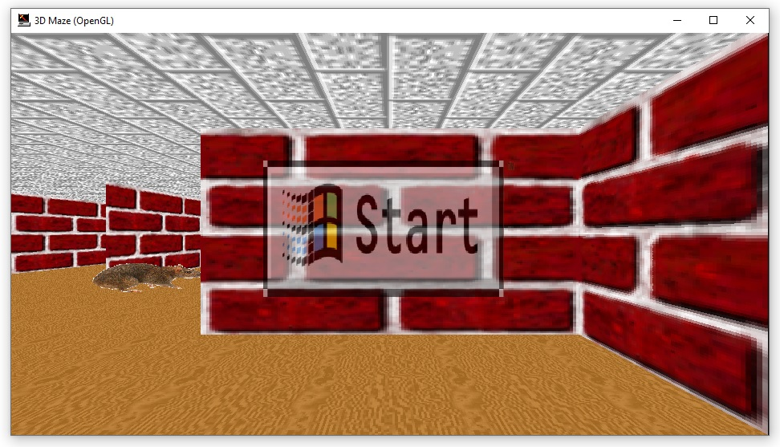

# Playable3DMaze
## Background
Windows 9x included a set of new screensavers to showcase OpenGL. One of these screensavers was [3D Maze](https://en.wikipedia.org/wiki/3D_Maze). This screensaver would automatically navigate the "player" through a randomly generated maze, continuing until it reached the endpoint.

As a child, I often thought Microsoft should have released a playable version of this game. This simple project brings that idea to reality!

## Implementation
While others have recreated this concept by building the game in modern game engines with the original textures, I chose a different approach. I reverse-engineered the original screensaver binary and modified it to enable player controls.

This wasn't particularly difficult as most of the core logic already exists within the executable. I hooked some internal functions to remove the computer-controlled aspects, and replaced them with user-controlled keyboard input.

The main executable (`Playable3DMazeLoader.exe`) launches an instance of the original 3DMaze screensaver (`ssmaze.scr`), and injects a DLL (`Playable3DMaze.dll`) to extend its functionality. Anti-virus software may detect this as a false-positive.

The SHA-256 hash of the original screensaver binary (`ssmaze.scr`) from Microsoft is `78852d8d5404fdbdcf9d785c9c0393c85de64efed4bd66cca02050bbf3608eaf`.

While other versions of `ssmaze.scr` exist, this project relies on hardcoded offsets, making this the only version compatible. For convenience, the correct binary is included within the project.

I also fixed a few minor bugs in the original executable, and added an option to toggle the overhead map view using the `Tab` key.

## Usage

Simply execute `Playable3DMazeLoader.exe`, ensuring that `Playable3DMaze.dll` and `ssmaze.scr` exist within the same directory.

The maze can be navigated with the arrow keys, and the `Tab` key toggles the overheap map.

